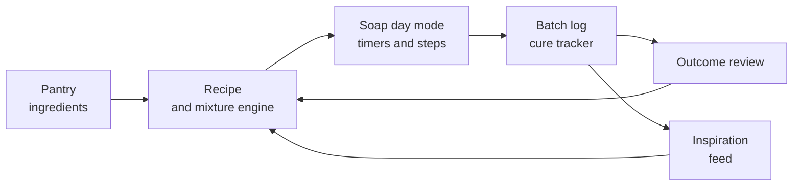
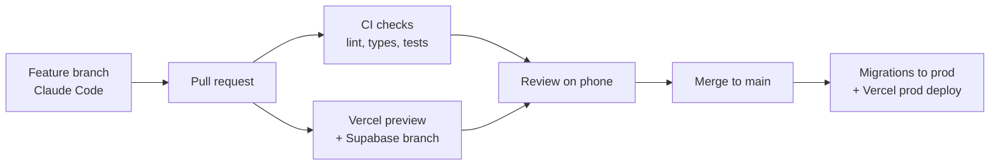

# PRD: Soap maker companion app

Version: 20 September 2026 · Author: Mark de Kock · Status: draft

## Summary and vision

Build the calm, safe workbench for amateur soap makers: one app that runs a batch from pantry to cured bar, remembers every recipe and result, and quietly rewards progress. Working name: **Soapbench** (placeholder).

The market is full of calculators but short on companions. Existing tools solve the lye maths; almost none guide the maker through soap day itself, track the 4 to 6 week cure, or connect results back to the recipe so the next batch is better.

**Product promise:** "Never guess, never forget, always improve."

- **Never guess:** a safe lye and mixture engine with plain-language guidance.
- **Never forget:** inventory, batch log, photos and cure reminders in one place.
- **Always improve:** outcome logging, inspiration from other makers and a background progression system that turns practice into mastery.

Primary market for v1: Dutch and EU hobbyists (metric-first, NL and EN), with a later English-language global rollout.

## Problem and market research

The need is real but the category is fragmented: calculators are solved, the soap-day experience and the learning loop are not.

### How amateurs make soap today

Three processes dominate. [Cold process](https://soapcalc.net/) (oils + lye, poured into a mould, cured 4 to 6 weeks) is what most makers do. Hot process cooks the batter so bars are usable in days. Melt and pour starts from a ready base and takes under an hour, which makes it the entry point for beginners and kids. Many makers start with melt and pour, move to cold process, and never leave.

A typical cold process session has a fixed rhythm: weigh lye and water, let the lye solution cool, weigh and melt oils, match temperatures, blend to trace, add fragrance and colour, pour, insulate, unmould after 24 to 48 hours, cut, then cure for weeks. Every step has a timer or a temperature attached, and most makers juggle this with a phone stopwatch, a spreadsheet and a paper notebook.

### Pain points (from maker blogs, supplier FAQs and troubleshooting guides)

| Pain point | What goes wrong | Opportunity for the app |
| --- | --- | --- |
| Lye fear and intimidation | Beginners find calculators like SoapCalc overwhelming, with too many output numbers ([Lovin Soap](https://lovinsoap.com/2016/07/online-soap-calculators-phone-apps-soap-makers/)) | Beginner mode that hides fatty acid detail until asked |
| Fragrance misbehaviour | Some fragrance oils cause acceleration, seizing, ricing, overheating or discolouration ([Bramble Berry](https://www.brambleberry.com/how-to/how-to-work-with-misbehaving-fragrances.html)) | Ingredient "behaviour flags" and a pre-batch risk check |
| Temperature control | Too hot accelerates trace; too cold causes soda ash and false trace ([Bramble Berry](https://www.brambleberry.com/beginner/common-soap-making-mistakes.html)) | Temperature targets per recipe, logged per batch |
| Accelerating ingredients | Honey, sugars, clove and cinnamon oils, and high shea or castor can speed trace or seize ([Wholesale Supplies Plus](https://www.wholesalesuppliesplus.com/blogs/articles/cold-process-soapmaking-faqs)) | Automatic warnings when a recipe stacks accelerators |
| Diagnosing failures | 30+ distinct defects (soda ash, cracks, heat tunnels, orange spots) with multiple possible causes ([Nerdy Farm Wife](https://thenerdyfarmwife.com/troubleshooting-cold-process-soap-problems/), [Soapy Friends](https://soapyfriends.com/cold-process-soap-troubleshooting-guide/)) | Photo-based troubleshooter linked to the batch log |
| Spoilage | Rancid oils cause dreaded orange spots and short shelf life ([Soapy Friends](https://soapyfriends.com/cold-process-soap-troubleshooting-guide/)) | Oil purchase and expiry dates in inventory |
| Losing track | Recipes, tweaks and outcomes scattered across notebooks and apps | One batch log tied to the recipe version |
| Hobby to side income | No handmade exemption from EU cosmetics law ([Phoenix Cosmetic Safety](https://phoenixcosmeticsafety.com/blogs/regulatory-compliance/cpsr-for-handmade-soap)) | Later: INCI and label helper, batch codes, cost per bar |

### Existing tools and gaps

| Tool | Strength | Gap |
| --- | --- | --- |
| [SoapCalc](https://soapcalc.net/) | Free since 2001, 150+ oils, NaOH and KOH, quality scores | Pure calculator; no batch day, cure or community |
| [Soapee](https://soapee.com/) | Single-screen live recalculation | Web only, calculator focus |
| [Soapmaking Friend](https://play.google.com/store/apps/details?id=com.soapmakingfriend.soapmf&hl=en_US) | Recipes, inventory, batch costing, public recipes, forum | Reviews cite missing fields and edit errors ([App Store](https://apps.apple.com/us/app/soapmaking-friend-soap-calc/id1633932803)); utilitarian feel |
| [Simple SoapCalc](https://apps.apple.com/us/app/simple-soapcalc-soap-calc/id6756240234) | Photo recipe import, blend advisor, "Make Soap mode" checklist and batch scaling | Newest threat; no community or progression layer |
| [LyeCalc](https://www.lyecalc.com/) | Recipes with photos, sharing, community | Web first, limited soap-day guidance |
| Facebook groups, Reddit, YouTube | Inspiration and troubleshooting | Unstructured; advice is not tied to your recipe |

**The white space:** no product combines a trustworthy calculator, a guided soap-day mode with timers, a cure tracker, structured outcome learning, curated inspiration and motivation. Simple SoapCalc is moving toward soap-day guidance, so speed matters.

### Market signals

Market size estimates disagree by an order of magnitude (roughly USD 0.17bn to USD 4bn for handmade soap), so treat them as directional only. More relevant: the DIY soap kit segment was estimated at USD 1.21bn in 2025 growing about 7% a year ([Growth Market Reports](https://growthmarketreports.com/report/diy-soap-kit-market)), and one report puts Europe at about a third of handmade soap demand ([Business Research Insights](https://www.businessresearchinsights.com/market-reports/handmade-soap-market-117948)). Kit buyers are exactly our funnel: they finish the kit and need a next step.

## Personas and jobs to be done

Design for the nervous beginner first; keep the enthusiast from outgrowing the app; leave a door open for the side-hustler.

| Persona | Profile | Main job to be done | What would make them quit |
| --- | --- | --- | --- |
| **Nina, the nervous starter** | 30 to 50, finished a melt and pour kit or a workshop, curious about cold process but scared of lye | "Help me make my first real batch safely and get a bar I am proud of" | Jargon, too many numbers, a failed first batch |
| **Ruben, the tinkering enthusiast** | 1 to 5 years in, 2 to 6 batches a month, owns 20+ oils and fragrances, experiments with swirls | "Help me design, repeat and improve recipes without spreadsheets" | Weak calculator, no import, data lock-in |
| **Sanne, the market-stall maker** | Sells at fairs or on Etsy, gifting has turned into small income | "Keep my batches consistent, costed and traceable" | No batch codes, no costing, no compliance help |
| **The gifter** (secondary) | Makes soap a few times a year for holidays and presents | "Give me a proven recipe and a plan I can follow" | Needing to learn chemistry first |

### Core jobs, in order of the soap journey

1. **Plan:** pick or design a recipe, check it is safe, see what I still need to buy.
2. **Prepare:** scale the batch to my mould, generate a shopping and weighing list.
3. **Make:** get step-by-step guidance with timers and temperature targets, hands-free.
4. **Cure and wait:** know when to unmould, cut, and when the bars are ready.
5. **Evaluate:** record how the batch turned out and what I would change.
6. **Get inspired:** discover designs, techniques and recipes from others.
7. **Grow:** feel myself getting better and unlock harder techniques.

## Core features

Five modules, one loop: the pantry feeds the recipe, the recipe drives soap day, soap day creates a batch, the batch outcome improves the recipe.

Every finished batch can be shared back into the inspiration feed, which is what makes the community grow from use rather than from posting effort.

### 1. Ingredients and pantry

- **Ingredient library:** 150+ oils, butters and waxes with SAP values (NaOH and KOH), fatty acid profile, INCI name and plain-language notes ("makes a hard, bubbly bar; drying above 30%").
- **Additives library:** clays, botanicals, milks, sugars, colourants, with usage ranges and behaviour flags (accelerates trace, overheats, discolours).
- **Fragrance and essential oil library:** usage rate, flash point, behaviour notes (accelerates, discolours, rices), and allergen data for later label features. Users add their own supplier fragrances and log how they behaved.
- **My pantry:** what I own, quantity in grams, supplier, price, purchase date and best-before. Oils nearing expiry are flagged because old oils cause orange spots.
- **Can I make it?** Any recipe shows what I have, what I am short of, and generates a shopping list.
- **Scan to add:** barcode or photo of a label to add stock (phase 2).

### 2. Recipe and mixture engine

- **Lye calculator:** NaOH, KOH and dual-lye; superfat; water as ratio, percentage of oils, or lye concentration. Metric-first.
- **Build by percentage or weight**, then scale to a mould: enter mould dimensions or pick a saved mould and get total oil weight.
- **Bar qualities** (hardness, cleansing, conditioning, bubbly, creamy, iodine, INS) shown as simple sliders in beginner mode and full numbers in expert mode.
- **Goal helper:** "harder bar", "gentler", "more lather", "palm-free", "vegan" suggests oil swaps with the reason.
- **Risk check before soap day:** flags stacked accelerators, fragrance above recommended rate, high water discount with a fast-moving fragrance, or oils past best-before.
- **Mixtures and sub-recipes:** save reusable blends (a fragrance blend, a colour mix, a milk or tea lye liquid) and drop them into any recipe; the engine keeps weights consistent when scaled.
- **Colour and design planner:** split batter into portions (for swirls or layers) and get weights per portion and colourant.
- **Other processes:** hot process and melt and pour templates; liquid soap (KOH paste and dilution) in phase 2.
- **Double-check mode:** the engine cross-validates results and never allows a negative or zero superfat without an explicit expert confirmation.

### 3. Soap day mode and timers

The hero feature. A full-screen, glove-friendly guided session generated from the recipe.

- **Pre-flight checklist:** safety gear, workspace, ingredients weighed and ticked off in process order (lye solution, oils, additives, fragrance).
- **Weighing assistant:** large numbers, running total, "tare and next" flow; optional Bluetooth kitchen scale integration later.
- **Parallel timers:** lye solution cooling, oils melting, milk or tea freezing, trace checks, gel insulation. Timers run in the background with notifications.
- **Temperature targets:** target range for lye and oils (for example 35 to 45 °C) with a log field; a warning when a recipe's fragrance behaves badly at higher temperatures.
- **Trace coach:** pulsed guidance ("stick blend 5 to 10 seconds, stir 20 seconds") with a visual trace guide (emulsion, thin, medium, thick).
- **Hands-free controls:** voice ("next step", "start timer") and large tap targets; screen stays awake.
- **Quick capture:** photo and voice note at any step, auto-attached to the batch.
- **Rescue button:** "it is seizing / ricing / separating" opens an in-the-moment fix (switch to hot process, hand stir, pour now).

### 4. Batches, cure tracker and recipe memory

- **Recipe versions:** every change creates a version; batches always point to the exact version used.
- **Batch log:** date, batch ID, temperatures, trace time, gel or no gel, room humidity, photos, notes, cost per bar.
- **Cure tracker:** automatic reminders for unmould (24 to 48 h), cut, turn bars, and "ready to use" at 4 to 6 weeks (configurable). Optional weight tracking to see water loss.
- **Outcome review:** at cut day and at cure end the app asks 5 quick ratings (hardness, lather, scent retention, look, skin feel) plus defect tags (soda ash, cracks, orange spots). This data powers personal insights: "your bars with more than 20% coconut score lower on skin feel".
- **Troubleshooter:** pick a symptom or upload a photo; get likely causes ranked by what is in your batch log.
- **Import and export:** import from SoapCalc and SoapCalc-style printouts, CSV, and photo of a written recipe (photo import phase 2); export to PDF and CSV. No lock-in.
- **Offline first:** soap day and recipes work without a connection.

### 4a. Batch tracking in detail

Every tray (mould) is its own batch with a name and a unique ID, so the mixture, the process and the result stay linked from soap day to the last bar.

**Structure: soap session > batches.** A soap session is one making day. It can hold several batches, for example two trays made today from the same recipe with different fragrances, or two different recipes back to back. Shared steps (one lye solution split over two trays) are logged once at session level; everything tray-specific is logged per batch.

**Naming and ID**

| Field | Rule | Example |
| --- | --- | --- |
| Batch ID | Auto-generated, unique, never changes: date + session number + tray letter | `260920-01-A` and `260920-01-B` |
| Batch name | Auto-suggested from recipe name and run number, always editable | "Lavender Oat #3, tray A" |
| Recipe link | Points to the exact recipe version used | Lavender Oat v4 |
| Label | Printable or shareable label with ID and QR code to stick on the curing tray | Scan to open the batch |

**What is tracked per batch**

| Stage | Captured |
| --- | --- |
| Mixture | Actual weights per ingredient (planned vs weighed, deviations highlighted), fragrance and colourant per portion, pantry lot used, cost per bar |
| Process | Lye and oil temperatures, room temperature and humidity, time to trace, trace level at pour, gel or no gel, insulation, timers used, photos and voice notes per step, any rescue action |
| Cure | Unmould and cut dates, bar count, optional weights over time, cure-ready date and reminders |
| Result | Photos at cut and at cure end, defect tags, dimension ratings (hardness, lather, scent retention, look, skin feel) |

**Success rating.** At cut day and again at cure end the maker gives one overall score: "How successful was this batch?" on a 1 to 5 scale, plus an optional one-line reason. The cure-end rating is the final one; the cut-day rating shows how first impressions change. Ratings roll up to the recipe, so a recipe shows its average success score across all batches and which variation scored best.

**Compare batches.** Select two or more batches (for example tray A and tray B from the same session) and see a side-by-side of mixture, process and ratings, with differences highlighted. This is where makers learn what actually made the difference.

**Promote a batch.** A well-rated batch can be saved as a new recipe version with one tap, carrying over the tweaks that were made on the day.

**Bar inventory per batch.** When the maker cuts a batch, the app records the bar count (for example 10 bars). From then on every bar has a status, and the batch shows where its bars went, for example "batch 260920-01-A: 10 bars, 3 curing, 2 in use, 2 packaged, 2 given away, 1 sold".

| Status | Meaning | Optional details |
| --- | --- | --- |
| Curing | Cut, not yet ready | Ready date from the cure tracker |
| Ready | Cured, in stock | Storage location |
| In use | Used by the maker at home | Date opened, later skin-feel rating |
| Packaged | Wrapped and labelled, ready to give or sell | Packaging type, cost |
| Given away | Gift | Recipient, occasion, feedback received |
| Sold | Sold at a market, online or to a friend | Price in EUR, channel, date (phase 2) |
| Discarded | Failed, damaged or spoiled | Reason (links to defect tags) |

Bars move between statuses in bulk with one swipe ("move 2 bars to Given away"), and bars curing move to Ready automatically at cure end. Every move is logged with a date, so the batch keeps a full history.

**Stock overview.** One screen shows all finished bars across batches: what is ready, what is still curing, and what is running low. "Only 1 bar of Lavender Oat left" can trigger a suggestion to plan the next batch, which the pantry check then turns into a shopping list.

**Why it matters:** gift feedback and home-use ratings feed back into the batch score; sold bars give revenue and margin per batch (with the cost per bar from the mixture); and for sellers the batch ID on each sold bar provides the traceability EU rules expect.

**Scope:** batch names, IDs, session grouping, success rating and the QR label are in the MVP; bar inventory with statuses is also MVP; price, channel and margin tracking for sold bars come in phase 2; batch comparison is MVP if time allows, otherwise first item of phase 2.

### 5. Inspiration and community

- **Inspiration feed:** finished bars from other makers, each with a "make this" button that opens the recipe (if shared) scaled to your mould and checked against your pantry.
- **Remix:** fork someone's recipe, credit is kept, and remixes are visible on the original.
- **Technique library:** short videos and step guides for swirls and designs (layers, in-the-pot swirl, drop swirl, Taiwan swirl, embeds), tagged by difficulty.
- **Monthly challenge:** a technique or ingredient theme; entries shown in a gallery with community voting.
- **Filters that matter:** process, difficulty, vegan, palm-free, sensitive skin, ingredients I own.
- **Ask the community:** questions attached to a specific batch so helpers see the actual recipe and photos.
- **Moderation:** recipes that fail the safety check cannot be published; reported content is reviewed.

## Background gamification

Gamification rewards real soap-making behaviour, never screen time, and stays out of the way until the maker looks for it. Soap has a built-in 4 to 6 week wait; the game layer exists to bridge that gap and keep people returning between batches.

### Design principles

1. **Invisible by default:** no pop-ups mid soap day, no confetti over a timer. Rewards are revealed at natural pauses (after cleanup, at cut day, at cure end).
2. **Reward craft, not clicks:** points come from completed batches, logged outcomes, and learning, not from opening the app.
3. **Never reward unsafe behaviour:** no streak pressure to make soap on a specific day, no rewards for speed.
4. **Mastery over competition:** personal progression first; social elements are opt-in.
5. **Opt-out:** a "quiet mode" hides all game elements for makers who find it childish.

### Mechanics

| Mechanic | How it works | Why it helps |
| --- | --- | --- |
| **Maker level** (Apprentice, Journeyman, Artisan, Master Soaper) | XP from completed batches, outcome reviews, technique firsts and helping others | Makes progress visible across months |
| **Technique tree** | Skills unlock in a sensible order: melt and pour, basic CP, colour, layers, in-the-pot swirl, milk soaps, advanced swirls, hot process, liquid soap | Doubles as a learning path; prevents beginners jumping to high-risk techniques |
| **Badges ("stamps")** | Collectible stamps for milestones: first batch, first unmould, first full cure, 10 oils used, first palm-free recipe, first rescue of a seized batch | Rewards learning moments, including failures |
| **Cure garden** | Curing batches appear as a visual shelf that "matures" over the weeks; ready bars glow | Turns the waiting period into anticipation and a reason to return |
| **Recipe mastery** | Making the same recipe 3 times with logged outcomes marks it "perfected" | Encourages the repeat-and-improve loop |
| **Pantry quests** | Gentle nudges: "use up your shea before it expires, here are 3 recipes" | Reduces waste and saves money |
| **Seasonal challenges** | Monthly community technique challenge with a gallery and a limited stamp | Social inspiration without leaderboards |
| **Helper reputation** | Upvoted troubleshooting answers earn a "mentor" level | Grows expert supply in the community |

### Where it shows up

- A small maker level ring on the profile tab.
- A single summary card after each batch review: XP gained, any stamp unlocked, next technique suggested.
- The cure garden on the home screen, which is useful information first and a game second.

## Soap notes and discovery

Borrow what wine apps (Vivino, CellarTracker) already solved: structured sensory rating for non-experts. This turns vague feedback like "I like the smell but the texture is off" into data that improves recipes and powers discovery.

### The bar review grid

Every rating, of your own bar or a bought one, follows the same fixed order, just as wine tasting goes look, nose, palate, finish.

| Step | What the user rates | Input |
| --- | --- | --- |
| Look | Colour, design, finish, defects | 1 to 5 plus defect tags |
| Scent in the bar | Strength and character dry | Scent wheel tags plus strength slider |
| Scent in use | How the scent throws in the shower and lingers | Strength slider |
| Lather | Amount and type of bubbles | Slider from big and bubbly to dense and creamy |
| Skin feel | Mild to cleansing, soft to squeaky | Two sliders |
| Longevity | How long the bar lasts, mushiness | 1 to 5 |
| Overall | "Would you use or buy it again?" | 1 to 5 plus one line |

### Soap profile and scent wheel

- **Profile sliders** (hard to soft, bubbly to creamy, mild to cleansing, subtle to strong scent) replace jargon. For your own recipes the app pre-fills them from the fatty acid profile; after use you confirm or correct, which teaches how numbers feel.
- **Scent wheel** with families (floral, citrus, herbal, woody, spicy, gourmand, fresh, earthy) and sub-notes. Tap-to-pick tags make reviews comparable and searchable, for example "woody, creamy, palm-free".

### Rate soap you did not make

- **Log a bought or gifted soap:** photo of the bar or label, maker name, where bought (market, shop, online), price, then the bar review grid.
- **My soap shelf:** personal collection of everything tried, own and bought, like a wine cellar.
- **Benchmark:** compare your own batch with a bought favourite on the same grid ("my lather 3.8, market bar 4.5").
- **Recipe hints:** ratings on bought soaps inform suggestions ("you rate creamy lather highly; try more castor or shea").

This widens the audience from makers to anyone who buys handmade soap, and every non-maker is a future maker or customer.

### Match score and maker pages

- **Match score:** a "likely match" percentage on recipes and soaps based on your past ratings, like Vivino's match score.
- **Maker pages:** makers who sell get a profile with their soaps, average scores and batch-linked reviews. Ratings of a sold bar can link to its batch ID, closing the loop to the maker's own data.
- **Best-before window:** borrowing the drinking window idea, each bar shows when it is at its best (cure complete, peak, use before oils age).

### Guardrails

- Personal notes first; public scores only from 5 ratings up.
- Reviews of small sellers are moderated, with a right to respond.
- No medical or skin-condition claims in reviews (for example "cured my eczema"), which also protects sellers under cosmetics rules.

**Scope:** the bar review grid for your own batches is MVP; scent wheel tags MVP light; bought-soap logging, shelf and match score are phase 2; maker pages are phase 3.

## Safety, legal and compliance

The calculator is a safety-critical feature: a wrong lye figure produces caustic soap, so correctness and liability are the top product risks.

### Product safety

- SAP values sourced from a documented reference set, versioned, and covered by automated regression tests against known recipes.
- User-added oils require a SAP value inside a plausible range; community-published recipes must pass the safety check.
- Safety onboarding before the first lye recipe: gloves, goggles, ventilation, "lye into water", keep away from children and pets. Short, skippable after first view, always accessible.
- Clear disclaimer: guidance only, the maker is responsible for their batch.

### Selling soap in the EU

There is no handmade or hobby exemption: EU Regulation 1223/2009 applies to a bar sold at a village fair exactly as to a supermarket product ([Lexora](https://lexoraeu.com/can-you-sell-cosmetics-from-home-eu/)). Selling requires a signed Cosmetic Product Safety Report, a Product Information File, CPNP notification, compliant labelling and an EU Responsible Person ([Certified Cosmetics](https://www.certifiedcosmetics.com/blog/start-a-business/do-you-need-a-license-to-sell-cosmetics-in-europe/)). Labels need INCI ingredients in descending order, declared fragrance allergens, net weight, batch identification and the Responsible Person's address; for soap the INCI reflects the saponified salts, which surprises new makers ([Phoenix Cosmetic Safety](https://phoenixcosmeticsafety.com/blogs/regulatory-compliance/cpsr-for-handmade-soap)).

**Implication for the app:** the app never claims to make a user compliant. From phase 2 it can reduce the work: auto-generated INCI lists, allergen totals from fragrance data, batch codes, and a PIF-ready recipe export for the safety assessor. A partnership with a CPSR provider is a natural paid add-on for the Sanne persona.

### Data and privacy

- GDPR-compliant account and data handling; recipes private by default, sharing is explicit.
- Users own their recipes: full export at any time.

## Release phases

Launch a focused MVP for Dutch and EU makers that owns soap day, batch tracking and the cure wait; add community, discovery and seller tools only once makers run real batches through the app. Because a cold process cure takes 4 to 6 weeks, every phase needs at least 8 weeks of live use before its results can be judged.

| Phase | Indicative timing | Scope | Exit criteria |
| --- | --- | --- | --- |
| **0. Foundation and closed alpha** | Months 1 to 2 | Data model, auth, ingredient library with SAP data, lye calculator with regression tests, recipe builder, basic soap day mode. 10 to 15 hand-picked makers | Calculator validated against 20 published recipes; 10 real batches completed in the app |
| **1. MVP launch (public beta, NL and EN)** | Months 3 to 5 | Everything in the MVP list below | 35% of signups complete a first batch within 14 days; 50% of batches get a cure-end rating |
| **2. Community and discovery** | Months 6 to 9 | Inspiration feed, recipe sharing and remix, monthly challenge, technique library, troubleshooter, bought-soap logging, soap shelf, match score, batch comparison (if not in MVP), sold-bar price and margin, KOH liquid soap, barcode pantry | 20% of active makers share at least one batch; week 8 retention above 30% |
| **3. Sellers and compliance** | Months 10 to 14 | Maker pages, INCI and label generator, allergen totals, PIF-ready export, CPSR partner, supplier integrations and affiliate shopping list, Seller add-on pricing | 100 paying sellers; first supplier partnership live |
| **4. Native and expansion** | Month 15 onwards | Native app wrapper with reliable offline and notifications, Bluetooth scale, personal insights from outcome data, other languages, adjacent crafts (candles, lotions) on the same engine | Decided on phase 3 data |

### MVP launch contents (phase 1)

**In:**

- Account, NL and EN, metric units, beginner and expert mode.
- Ingredient library (oils, butters, common additives, fragrance behaviour flags) and personal pantry (manual entry, best-before dates).
- Lye calculator for NaOH cold and hot process, recipe builder by weight or percentage, mould library and scaling, recipe versions, risk check.
- Melt and pour templates as the beginner on-ramp.
- Soap day mode: pre-flight checklist, weighing assistant, parallel timers, temperature targets, trace coach, quick photo and voice capture, rescue button.
- Batch tracking: sessions with trays, batch IDs and names, QR label, mixture and process log.
- Cure tracker with reminders; bar inventory with statuses.
- Bar review grid for own batches, success rating, scent wheel tags (light).
- Gamification basics: maker level, technique tree, first stamps, cure garden, quiet mode.
- Import from CSV and SoapCalc-style recipes; export to PDF and CSV.
- Free tier plus Maker Pro subscription.

**Out (and why):** community feed and sharing (needs content and moderation first), liquid soap (different workflow), compliance tools (seller segment is smaller and needs expert review), native apps (validate on web first).

### Launch approach

- Closed alpha via Dutch soap Facebook groups, workshop hosts and one supply shop partner.
- Public beta opens with 20 curated recipes and 5 technique guides produced in-house, so the app is useful on day one without a community.
- First monthly challenge runs at the start of phase 2, seeded with alpha makers.

## Monetisation and success metrics

Freemium with a low-priced Maker Pro subscription funds the MVP; seller tools and supplier partnerships become the second revenue line from phase 3.

### Monetisation (freemium)

- **Free:** calculator, 10 saved recipes, soap day mode, cure tracker, community browsing (once the community ships in phase 2).
- **Maker Pro** (indicative EUR 3.99 per month or EUR 29.99 per year): unlimited recipes and versions, pantry and costing, advanced insights, full technique library, export.
- **Seller add-on** (phase 3): INCI and label tools, batch codes, CPSR partner discounts.
- **Partnerships:** supplier affiliate links from the shopping list (disclosed), and sponsored challenges from ingredient suppliers. No ads inside soap day mode.

### Success metrics

| Metric | Target at 6 months after launch |
| --- | --- |
| Activation: first batch completed in soap day mode within 14 days of signup | 35% |
| Cure return: completed batches that get a logged outcome at cure end | 50% |
| Batches per active maker per month | 1.5 |
| Week 8 retention (covers one full cure) | 30% |
| Free to Pro conversion | 4% |
| Safety: calculator defects reported and confirmed | 0 |

## Technical approach

Build the MVP as an installable web app (PWA) on Next.js and Vercel with Supabase as the backend, developed in GitHub with Claude Code; wrap it as a native app in phase 4 only if notifications or offline use demand it.

### Stack

| Layer | Choice | Notes |
| --- | --- | --- |
| Frontend | Next.js (App Router), TypeScript, Tailwind | PWA: installable, service worker, offline cache |
| Hosting | Vercel | Git-connected; preview deployment per pull request; functions in EU region (fra1) |
| Database and auth | Supabase Postgres + Auth | EU region (Frankfurt) for GDPR; Row Level Security on every table |
| Files | Supabase Storage | Batch photos and voice notes, per-user bucket policies, image resizing on upload |
| Background jobs | Supabase Edge Functions + pg_cron | Cure reminders, unmould and cut notifications, bar status updates at cure end |
| Notifications | Web Push (VAPID) + email via Resend | Web Push on iOS works only when the app is added to the home screen, so onboarding prompts install |
| Payments | Stripe subscriptions | Maker Pro; webhook updates the user's plan in Supabase |
| Analytics and errors | PostHog (funnels, events) + Sentry | Activation and cure-return metrics from this section's targets |
| Source control and CI | GitHub + GitHub Actions | Branch, pull request, checks, merge |

### Key technical decisions

- **Soap calculator as its own package** (`packages/soap-calc`): pure TypeScript, no dependencies, 100% unit-test coverage, validated against published recipes. It runs in the browser (offline soap day) and on the server (re-validation before saving or publishing). Safety-critical code never lives inside UI components.
- **Reference data under version control:** SAP values and fatty acid profiles ship as seed files in the repo; every change is a reviewed pull request with a changelog.
- **Timers that survive a closed app:** in-session timers run on the device with a screen wake lock; every timer and cure milestone is also stored as an end timestamp in Supabase, so the server sends the reminder even if the phone is locked or the app closed.
- **Offline first for soap day:** the active recipe, session and batch are cached locally (IndexedDB); logs sync to Supabase when the connection returns.
- **Private by default:** RLS policies make every recipe, batch and rating visible only to its owner until explicitly shared.

### Core data model

| Table | Holds |
| --- | --- |
| `profiles` | User settings, language, units, plan, maker level |
| `ingredients` | Global library plus user-custom entries (SAP, fatty acids, INCI, behaviour flags) |
| `pantry_items` | User stock: quantity in grams, price, supplier, purchase and best-before dates |
| `recipes`, `recipe_versions`, `recipe_items` | Recipe, immutable versions, ingredient lines |
| `moulds` | Saved moulds with dimensions and capacity |
| `sessions` | A soap day, shared steps |
| `batches` | One tray: batch ID, name, recipe version, status |
| `batch_items`, `batch_events` | Actual weights; timestamped process log (temperatures, trace, photos, rescues) |
| `bar_movements` | Bar inventory: status changes with count, date, recipient or price |
| `ratings` | Bar review grid, linked to a batch or a bought soap |
| `bought_soaps` | Soaps from other makers (phase 2) |
| `xp_events`, `stamps`, `user_stamps` | Gamification ledger |

### Way of working: GitHub, Vercel and Supabase

Every change goes through a pull request with its own preview app and database branch; production only changes on merge to `main`.

1. **One GitHub repository** (monorepo): `apps/web` (Next.js), `packages/soap-calc`, `supabase/` (migrations, seed, Edge Functions), `CLAUDE.md` in the root.
2. **Branches:** `main` is production and protected; work happens on short-lived feature branches, one pull request per feature.
3. **Environments:** local (Supabase CLI in Docker), preview (Vercel preview + Supabase branch per pull request), production (Vercel production + Supabase production project). Environment variables live in Vercel and GitHub Secrets, never in the repo; `.env.example` documents them.
4. **Database changes only through migrations:** schema changes are SQL files in `supabase/migrations`, created locally (`supabase migration new`, `supabase db diff`) and committed. Nobody edits the production schema in the Supabase dashboard. On merge, a GitHub Action runs `supabase db push` against production before the Vercel deploy finishes.
5. **Typed database:** `supabase gen types` output is committed, so the frontend breaks at build time if the schema changes.
6. **CI checks required before merge:** lint, typecheck, `soap-calc` unit tests, and a Playwright smoke test against the Vercel preview URL (create recipe, start soap day, log batch).
7. **Claude Code workflow:** `CLAUDE.md` holds product context, data model, conventions and the current phase. Work phase by phase, one feature per branch; Claude Code opens the pull request; review the preview on a phone (the real soap day device) before merging.
8. **Releases and flags:** tag each release; beta features sit behind a `feature_flags` table so they can be switched on for alpha makers only.

### Indicative running costs at MVP

Approximate, from standard plans: Vercel Pro and Supabase Pro at roughly USD 20 to 25 per month each, plus low usage-based costs for storage, Resend and Sentry. Photo storage is the main cost driver as batches grow; resize on upload to keep it down.

## Risks, open questions and next steps

### Risks

| Risk | Mitigation |
| --- | --- |
| Calculator error causes harm | Reference data set, regression tests, independent review by an experienced soaper or cosmetic chemist before launch |
| Free calculators make the core feature a commodity | Differentiate on soap day, cure tracking and learning loop, not on maths |
| Simple SoapCalc or Soapmaking Friend ship similar features | Move fast on the MVP; build community content moat |
| Gamification feels childish to experienced makers | Quiet mode; craft-based rewards; test with Ruben persona |
| Small niche limits revenue | Supplier partnerships and seller add-on; expand to candles and cosmetics later on the same engine |
| Community moderation load | Safety check gate on publishing; start with curated content |

### Open questions

- [ ] Launch market: the draft assumes Dutch and EU first (NL and EN, see Summary); confirm, or go English-first globally?
- [ ] Proposed: PWA first, native wrapper in phase 4 (see Technical approach). Confirm once the alpha shows how makers use notifications on iOS.
- [ ] Which reference source to license or adopt for SAP values and fatty acid profiles?
- [ ] Melt and pour templates are in the MVP list as the beginner on-ramp; confirm, or launch with cold process only?
- [ ] Partner with a supplier (for example a Dutch soap supply shop) for launch content and distribution?

### Next steps

- [ ] Interview 10 to 15 makers (5 starters, 5 enthusiasts, 3 sellers) via Dutch soap Facebook groups and workshops.
- [ ] Test the soap day mode as a clickable prototype during a real batch with 5 makers.
- [ ] Validate the calculator against 20 published recipes from SoapCalc.
- [ ] Decide name, launch market and platform.

## Sources

- [SoapCalc](https://soapcalc.net/)
- [Soapee](https://soapee.com/)
- [Simple SoapCalc, App Store](https://apps.apple.com/us/app/simple-soapcalc-soap-calc/id6756240234)
- [Soapmaking Friend, App Store](https://apps.apple.com/us/app/soapmaking-friend-soap-calc/id1633932803) and [Google Play](https://play.google.com/store/apps/details?id=com.soapmakingfriend.soapmf&hl=en_US)
- [LyeCalc](https://www.lyecalc.com/)
- [Lovin Soap: calculators and apps](https://lovinsoap.com/2016/07/online-soap-calculators-phone-apps-soap-makers/) and [using lye calculators](https://lovinsoap.com/2016/12/using-lye-calculators-soap-making/)
- [Bramble Berry: common mistakes](https://www.brambleberry.com/beginner/common-soap-making-mistakes.html) and [misbehaving fragrances](https://www.brambleberry.com/how-to/how-to-work-with-misbehaving-fragrances.html)
- [Wholesale Supplies Plus: CP FAQ](https://www.wholesalesuppliesplus.com/blogs/articles/cold-process-soapmaking-faqs)
- [The Nerdy Farm Wife: troubleshooting](https://thenerdyfarmwife.com/troubleshooting-cold-process-soap-problems/)
- [Soapy Friends: troubleshooting guide](https://soapyfriends.com/cold-process-soap-troubleshooting-guide/)
- [Lexora: selling cosmetics from home in the EU](https://lexoraeu.com/can-you-sell-cosmetics-from-home-eu/)
- [Certified Cosmetics: licence to sell in Europe](https://www.certifiedcosmetics.com/blog/start-a-business/do-you-need-a-license-to-sell-cosmetics-in-europe/)
- [Phoenix Cosmetic Safety: CPSR for handmade soap](https://phoenixcosmeticsafety.com/blogs/regulatory-compliance/cpsr-for-handmade-soap)
- [Growth Market Reports: DIY soap kit market](https://growthmarketreports.com/report/diy-soap-kit-market)
- [Business Research Insights: handmade soap market](https://www.businessresearchinsights.com/market-reports/handmade-soap-market-117948)
