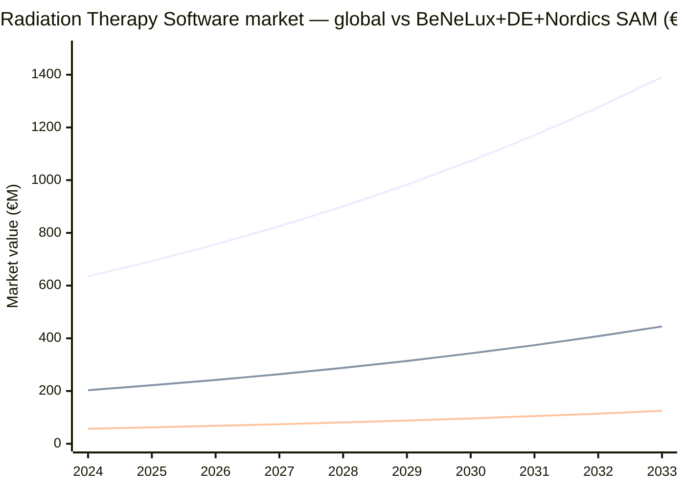
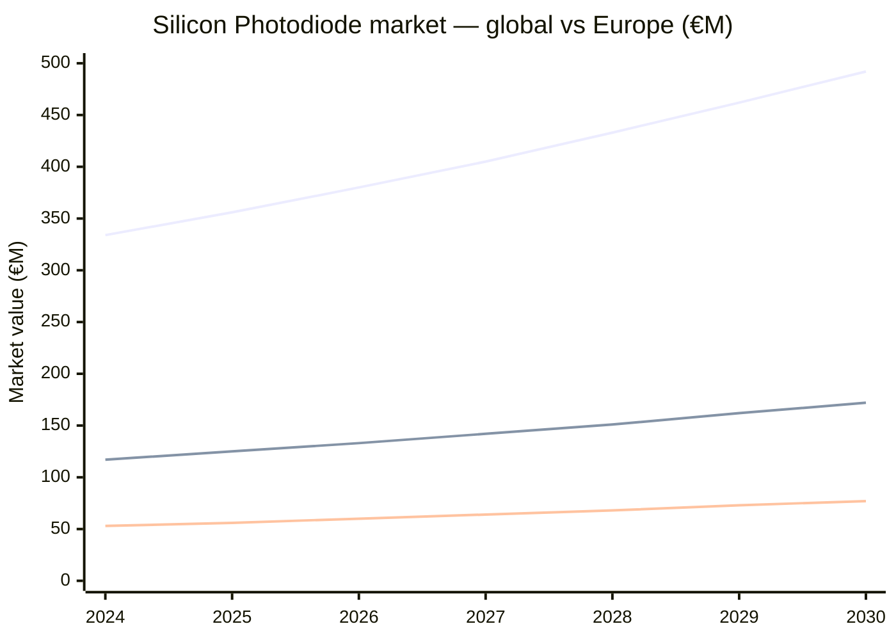
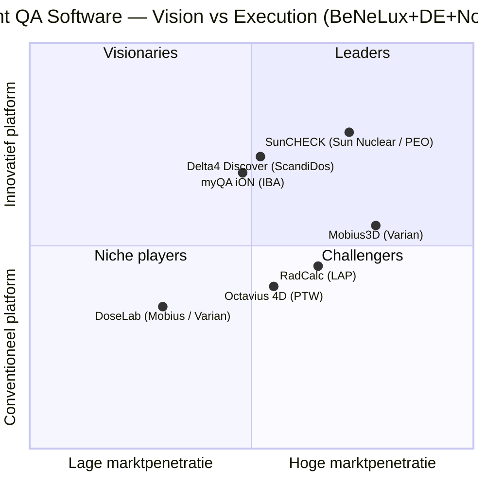
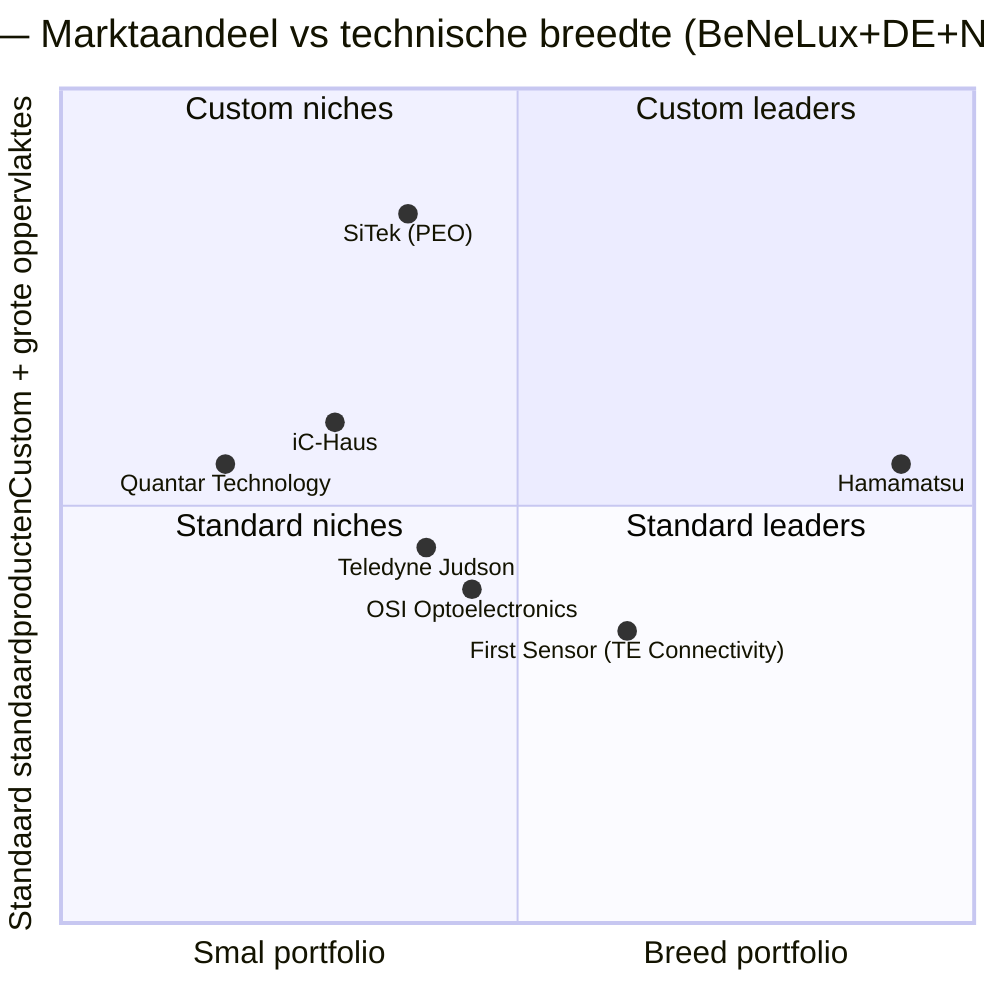

# PEO Product Matrix — PREVIEW

**Status:** preview / sanity check — niet de finale matrix.
**Doel:** valideer format, kolomkeuze, diepte en visuele stijl voordat ik schaal naar het hele portfolio (~80-100 SKU's × 3 regio's).
**Methode:** SKU-niveau, hele portfolio, top-down TAM, alle concurrenten, best-effort met confidence-rating.

> **TAM-benadering BeNeLux + DE + Nordics:** combineer ~150 M inwoners, hoge healthcare-spend per capita, sterke industriële cluster (semicon NL/DE, defence DE/Nordics, optics DE). Heuristisch is dit ~25-30% van het Europese TAM voor deze niches. Per cel een confidence-rating: 🟢 high (publieke bron), 🟡 medium (extrapolatie), 🔴 low (zachte schatting / vraagt validatie).

---

## 1. Sample matrix — 10 representatieve SKU's

Tien rijen uit de drie verticals om de kolommen te valideren. Compactgehouden voor leesbaarheid; in de finale matrix wordt elke cel iets uitvoeriger.

| # | SKU | Vertical | Partner-merk | TAM BeNeLux+DE+Nordics (€/jr) | Top-3 concurrenten (fabrikant/distributeur) | Pricing-strategie | Tone-of-voice | Reden om PEO te kiezen | Confidence |
|---|---|---|---|---|---|---|---|---|---|
| 1 | **SunCHECK Patient** | Medical | Sun Nuclear | €18-25 M 🟡 | Mobius3D (Varian/Siemens) · RadCalc (LAP) · Delta4 Discover (ScandiDos) | Software-licentie + jaarlijkse maintenance (~€25-60k initieel + 18-22% SMA) | Klinisch, evidence-based, "1-platform-voor-alles" | Lokale klinische support, 100+ NL/BE-ziekenhuis-referenties, training in NL | 🟢 |
| 2 | **SunCHECK Machine** | Medical | Sun Nuclear | €12-18 M 🟡 | Mobius FX · ArcCheck workflow · IBA myQA Machines | Bundle-korting met Patient-licentie | Workflow-efficiëntie, machine-uptime | Eén database voor Patient+Machine QA bij dezelfde fysicus | 🟢 |
| 3 | **3D Cylindrical Water Tank Scanner (SunSCAN)** | Medical | Sun Nuclear | €6-10 M 🟡 | PTW Beamscan · IBA Blue Phantom 2 · Standard Imaging DoseView | CapEx ~€80-150k | Snelheid + nauwkeurigheid bij commissioning | Vervangt full-week commissioning, bewezen workflow | 🟢 |
| 4 | **Gafchromic EBT3/MD-V3 film** | Medical | Ashland | €1.5-3 M 🟡 | EBT-XD (Ashland zelf) · Radiochromic alternatieven (Dosimetry Solutions) · GAFchromic XR-RV3 | Verbruiksgoed, marge ~25-35% | Pragmatisch, accent op "real-world dose verification" | Kennis van scanner-protocol + film-handling, voorraad in NL | 🟢 |
| 5 | **PED — Personal Electronic Dosimeter** | Detection | Mirion / Tracerco / Polimaster | €8-15 M 🟡 | Thermo EPD-Mk2 · RaySafe i3 · Polimaster PM1610 | Per-stuk €600-2.500, vaak frame-contracten | Compliance, regulatory, "always on" | EU-kalibratiecertificering + service-loaner-pool | 🟡 |
| 6 | **HPGe Detector (coaxiale, 30-50% rel. eff.)** | Detection | Mirion (Canberra) / ORTEC | €12-20 M 🟡 | Mirion Broad-Energy · ORTEC GMX/GEM · Baltic Scientific BSI · CAEN HEXAGON | CapEx €40-90k + LN2/electric cooling consumables | Wetenschappelijk, traceerbaarheid, IAEA-conform | Kalibratiedienst on-site + LN2-logistiek BeNeLux | 🟡 |
| 7 | **Magnetic Static Detector (MSD)** | Detection | CEIA | €4-8 M 🔴 | Smiths Detection HI-SCAN · Garrett MZ-6100 · Rapiscan Metor | Per-poort €8-25k, bundles met WTMD | Trust, zekerheid, security-grade | Defence/customs-referenties + tender-ondersteuning | 🟡 |
| 8 | **Silicon Photodiode w/ integrated amplifier** | Photonics | Centronic | €5-9 M 🟡 | Hamamatsu S5973 · OSRAM BPW34 · Vishay BPV10NF · First Sensor (TE) | Per-stuk €15-150 (volume tiered) | Technisch/specsheet, engineer-to-engineer | Hoge SKU-coverage + sample-/loaner-snelheid | 🟢 |
| 9 | **PSD — Position Sensitive Detector (1D/2D)** | Photonics | SiTek | €6-10 M 🟡 | Hamamatsu PSD-series · OSI Optoelectronics · Quantar Technology · iC-Haus | Per-stuk €120-1.200, custom-batch op offerte | Sub-micron precisie, wetenschappelijk | Custom-design met SiTek + EU-lead-time-voordeel | 🟢 |
| 10 | **GL Photometer 3.0 + Flicker** | Photonics | GL Optic | €2-5 M 🟡 | Konica Minolta CL-200 · Gigahertz-Optik BTS256 · TechnoTeam LMK · Instrument Systems CAS 140D | CapEx €4-9k | Speed + accuracy, "lab-grade portable" | Combinatie photometer + integrating sphere uit één hand | 🟢 |

**Kolomkeuze-validatie:** zijn deze 9 kolommen de juiste set, of ontbreekt er iets? Veel-gevraagde extra's: *"Lead time"*, *"Service contract beschikbaar (ja/nee)"*, *"Marge-indicatie"*, *"Strategische prioriteit (A/B/C)"*, *"Cross-sell potentieel"*.

---

## 2. Markttrend-grafieken

### 2.1 Radiation Therapy Software — globaal en geprojecteerd BeNeLux+DE+Nordics aandeel

> Bron: Custom Market Insights / FMI / PharmiWeb — global $635M (2024) → $1.39B (2033), CAGR 9.1%. EU-share ~30-35%, deze drie subregio's binnen EU op basis van healthcare-spend per capita ~28%. Confidence: 🟡 (groei-rate is hard, regio-split is extrapolatie).

### 2.2 Silicon Photodiode market

> Bron: Business Research Insights / Mordor — global $333M (2024) → $492M (2030), CAGR 6.7%. Europa ~35% globaal. Deze regio is overrepresented door semicon-cluster (ASML, imec, infineon, NXP). Confidence: 🟡.

---

## 3. Gartner-style competitor quadrants

### 3.1 Patient QA Software (Radiotherapy)

> Beoordeling op basis van publieke installed-base, productroadmap en analyst-coverage — geen interne data. Sun Nuclear positioneert in *Leaders* door SunCHECK-platform-strategie + 1.000+ wereldwijde installs; Mobius heeft hoogste Europese penetratie via Varian-channel; Delta4/IBA innovatief maar regionaal kleiner. Confidence: 🟡.

### 3.2 Position Sensitive Detectors (Photonics)

> SiTek's positie is custom-design + grote PSD-oppervlaktes — daar zit ook de strategische edge voor PEO Photonics tegenover Hamamatsu's volume-portfolio. Confidence: 🟡.

---

## 4. Wat ik nu zie aan structuur — observaties

- **Medical** is best te modelleren: relatief geconsolideerd (Sun Nuclear / IBA / PTW / Varian / ScandiDos) en publieke marktrapporten zijn beschikbaar.
- **Detection** is moeilijker: TAM-cijfers zijn er wel ($12.7B globaal voor explosive detection), maar de splits naar BeNeLux+DE+Nordics zijn vooral gebaseerd op tender-archieven en defence-budgetten — daar wordt de confidence vaker 🔴.
- **Photonics** zit ertussenin: photodiode-/PSD-markten zijn goed gedocumenteerd, maar speciaalgebieden (SEEPOS, custom electron/ion sensors) hebben weinig publieke benchmarks.

---

## 5. Bekende gaps / waar ik validatie nodig heb

1. **Volledige SKU-lijst per vertical** — ik heb nu ~50 product-/categorie-pagina's gevonden via Google's index. Voor SKU-niveau (~70-100 rijen) heb ik óf de XML-sitemap óf een handmatige product-lijst van jou nodig. Anders zit ik op ~70% coverage met 30% gokwerk.
2. **Partner-mapping per SKU** — voor sommige producten staat de partner-fabrikant niet expliciet op de site (bijv. wie levert de PED in de PEO-line: Mirion of Polimaster?). Beïnvloedt concurrent-analyse direct.
3. **PEO's distributierechten per regio** — TAM in Nordics is alleen relevant voor SAM als PEO daar mag verkopen. Voor sommige merken is BeNeLux exclusief, voor andere mag PEO ook DE/AT.
4. **Pricing-realiteit** — alle prijzen in deze preview zijn publieke list-/extrapolatie-cijfers. Voor "echte" pricing-strategie heb ik jullie list-prijzen of recent-deal-data nodig (NDA OK).
5. **Strategische prioriteit per SKU** — niet elk SKU verdient even diepe analyse. Een A/B/C-classificatie van jullie kant maakt de finale matrix 10× bruikbaarder.

---

## 6. Voorgestelde vervolgstap (validatie-checkpoint)

Geef hieronder feedback op:

- [ ] Kolommen kloppen (of: ik wil nog kolom X erbij)
- [ ] Visuele stijl werkt (Mermaid in markdown / GitHub) — of liever PNG-export voor in Word
- [ ] Granulariteit klopt (zo goed met 10 hier? in finale 70-100 rijen)
- [ ] Vertrouwen in TAM-extrapolatie (~28% EU-share voor BeNeLux+DE+Nordics) is bruikbaar als heuristiek
- [ ] Kun je gap 1 (SKU-lijst) en/of gap 5 (A/B/C) aanleveren?

Bij groen licht ga ik door en lever:
1. **Excel-werkbestand** (`peo-product-matrix.xlsx`) met alle ~80-100 SKU's, alle kolommen, confidence-ratings en bron-links.
2. **Word-management-summary** (`peo-product-matrix-summary.docx`) met huisstijl-header, top-10 winsten per vertical, en ingebakken trend-grafieken + Gartner-quadranten als afbeeldingen.

---

## Bronnen (deze preview)

- [Custom Market Insights — Radiation Therapy Software market](https://www.custommarketinsights.com/report/radiation-therapy-software-market/)
- [PharmiWeb — Global Radiation Therapy Software US$847M @ CAGR 8.2%](https://www.pharmiweb.com/press-release/2023-11-21/global-radiation-therapy-software-industry-reaching-a-robust-value-of-us-8479-million-at-a-cagr-o)
- [Future Market Insights — Radiation Therapy Software](https://www.futuremarketinsights.com/reports/radiation-therapy-software-market)
- [LAP RadCalc — 2.300+ installs](https://www.radcalc.com/)
- [Sun Nuclear — SunCHECK product](https://www.sunnuclear.com/suncheck)
- [Sun Nuclear — vendor comparison chart](https://www.sunnuclear.com/about/news/comparison-chart-radiation-therapy-quality-assurance-platforms)
- [IBA + ScandiDos strategic alliance](https://www.iba-worldwide.com/iba-and-scandidos-form-strategic-alliance-increase-access-safe-radiotherapy)
- [Business Research Insights — Silicon Photodiodes market](https://www.businessresearchinsights.com/market-reports/silicon-photodiodes-market-104921)
- [Mordor Intelligence — Photodiode Sensors](https://www.mordorintelligence.com/industry-reports/photodiode-sensors-market)
- [Verified Market Reports — 2D PSD market](https://www.verifiedmarketreports.com/product/2d-position-sensitive-detector-market/)
- [IndustryARC — Optical PSD market](https://industryarc.com/Report/18595/optical-position-sensing-detector-market.html)
- [Hamamatsu — PSD selection guide](https://www.hamamatsu.com/content/dam/hamamatsu-photonics/sites/documents/99_SALES_LIBRARY/ssd/psd_kpsd0001e.pdf)
- [Straits Research — Explosive Detector market](https://straitsresearch.com/report/explosive-detector-market)
- [Mordor Intelligence — ETD market](https://www.mordorintelligence.com/industry-reports/explosive-trace-detection-market)
- [Valuates — HPGe Detectors market](https://reports.valuates.com/market-reports/QYRE-Auto-23H14241/global-high-purity-germanium-hpge-detectors)
- [PEO Medical — Products index](https://peomedical.com/products/)
- [PEO Medical — SunCHECK Platform](https://peomedical.com/radiotherapy/qa-measurement-systems/suncheck-platform/)
- [PEO Medical — MapPHAN](https://peomedical.com/radiotherapy/qa-measurement-systems/mapphan-sun-nuclear/)
- [PEO Medical — TomoDose](https://peomedical.com/radiotherapy/qa-phantoms-2/tomodose-scanning-system-sun-nuclear/)
